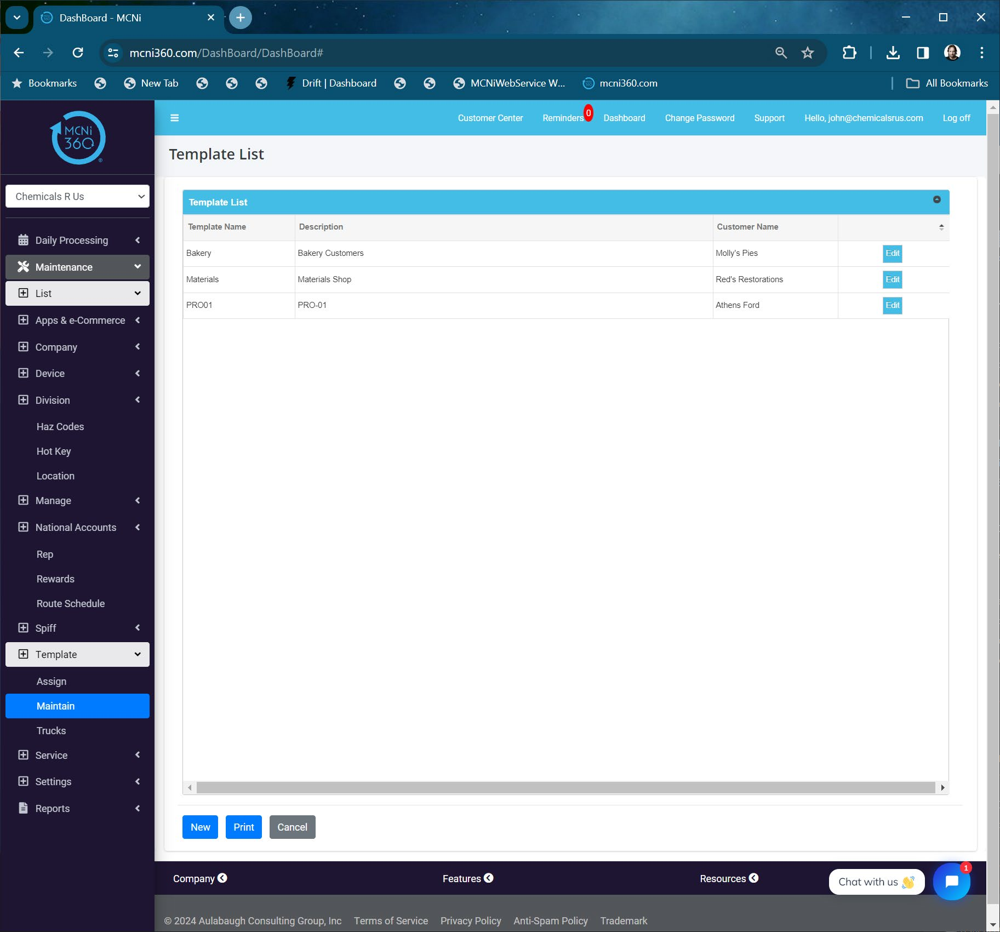
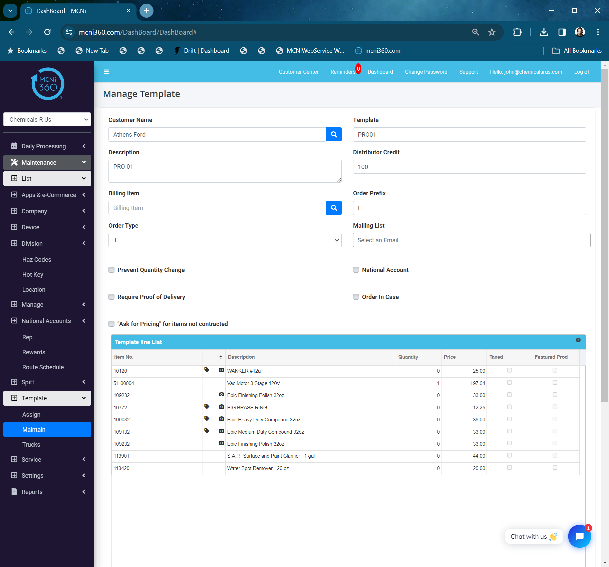
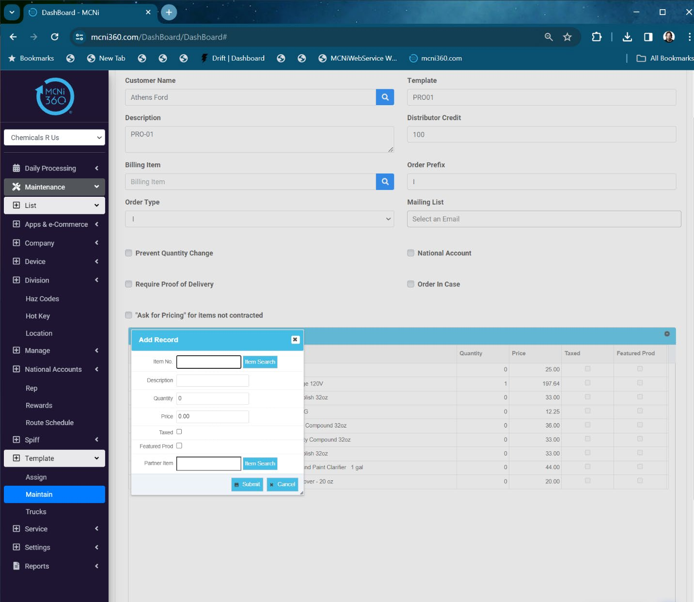
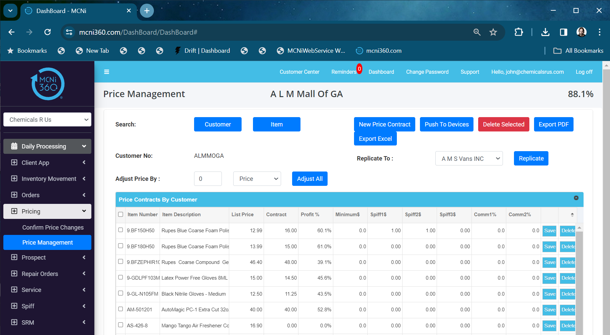
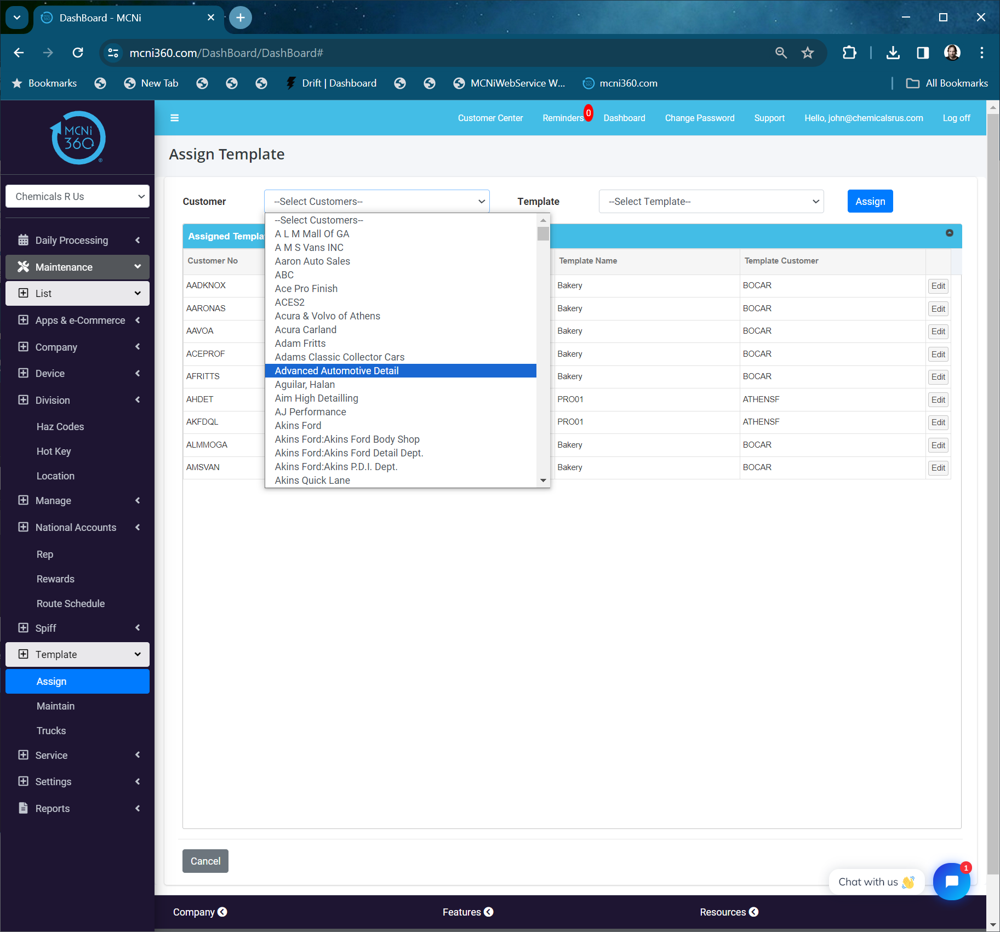
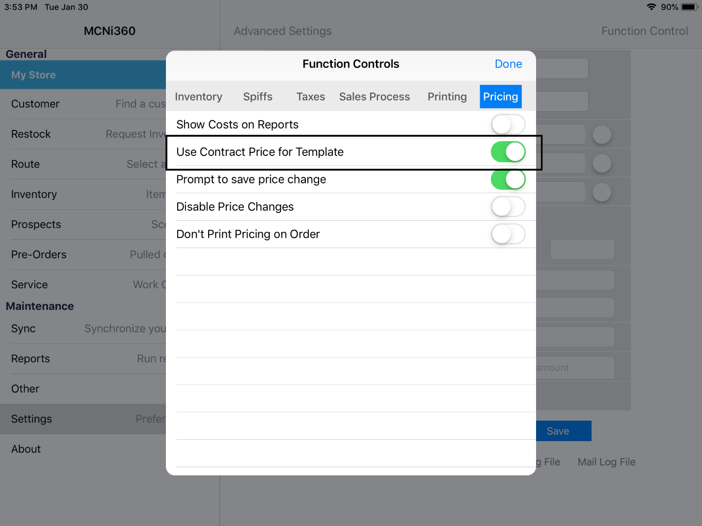
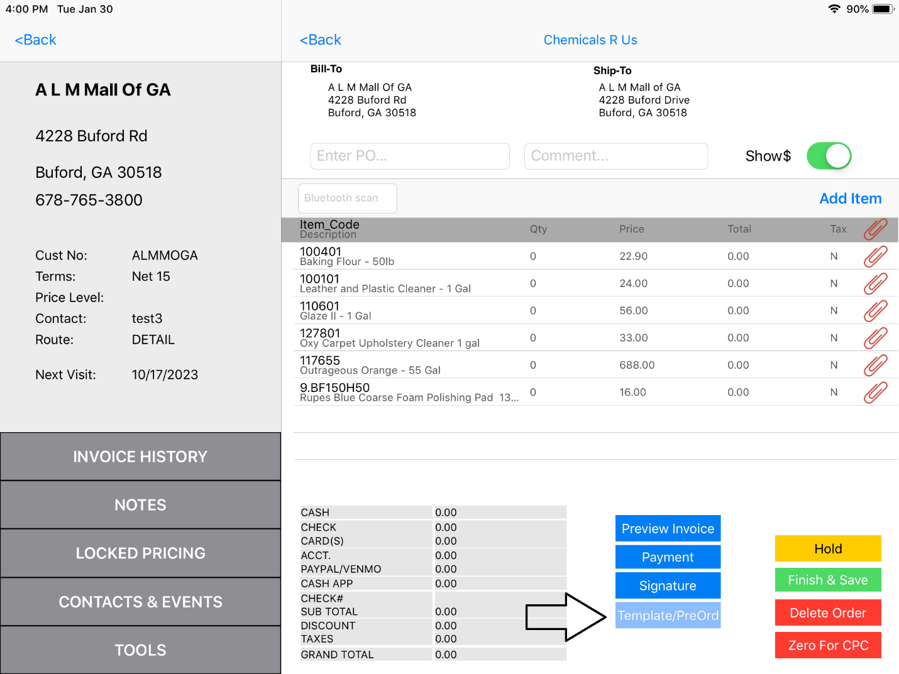

# MCNi Training

## Templates

**[Download reference document](../static/pdf/MCNi-Training-Templates.pdf)**

### Overview

Templates are used to hold a list of items that a certain customer or group of customers would purchase from you. The templates are currently managed via the website mcni360.com but will soon be managed with the iPad/iPhone app as well.

### Creating a Template

Login to MCNi360.com and navigate to:

**Maintenance->List->Template->Maintain**

### Modify an Existing Template

To modify an existing template, press EDIT on the row. To create a new template, click **NEW**.

- **Customer Name** – select a customer that would be a candidate to use the template you are building. This is just an anchor for the template.
- **Template** – name the template so you will recognize it when searching.
- **Description** – Use this for any added information.
- **Distributor Credit** – this is not use with the mobile app, but must have a value. Make it 100.
- **Billing Item** - not used (use for national account processing).
- **Order Prefix** – not used but required, so make it I for Invoice.
- **Order Type** – not used but required, make it Invoice.
- **Mailing List** – not used
- **Checkmarks** – leave all unchecked. These are used in our B2C e-Commerce system.

### Adding Items to a Template

Use the `+` buton at the botom-left corner of the grid. Search for the item you want and save it.

- **Item No** – the item number will show here when you select an item.
- **Description** – the description of the item you selected (auto-populated)
- **Quantity** – this defaults to zero so that the user can just populate how many the customer wants. If you put a quantity in this field, that quantity will show on the invoice. This iscommonly used for a surcharge, demurrage or trip/fuel charge.
- **Price** – This is the price the item will be sold for, but if you have a switch set on the device, it will use the contracted price for the item instead of the price in the template. We will address the switch in this document.
- **Taxed** – if the item is taxed or not.
- **Featured Product** – this is used for the e-Commerce app
- **Partner Item** – this is used for EDI translations

If you have the Function Control setting under Pricing named Use Contract Price for Template, then you can manage all of your pricing in,

**Daily Processing - > Pricing -> Price Management**

Price Management is addressed in a separate video

- **NOTE**: If you make changes to the templates, or pricing in Price Management, you will need to do a SYNC on mcni360.com to make the changes available to the mobile devices.

### Assigning a Customer

Now that we have the template created and the pricing established for the customer in question, we need to assign the customer to this template. Go to:

**Maintenange -> List -> Template -> Assign**

Select the customer you want to assign.
Select the template you want the customer to use
Click **ASSIGN**

Turn On Use Contract Pricing
On the iPad or iPhone, click **Settings->Function Control->Pricing**
Turn on Use Contract Price for Template

Click **DONE** and then **SAVE**.

### Loading a Template

To load the template, select your customer and click **INVOICE**. Then, click
**Template/PreOrd**

The items in the template will automatically load.
Touch the item your customer wants to buy and enter the quantity.
